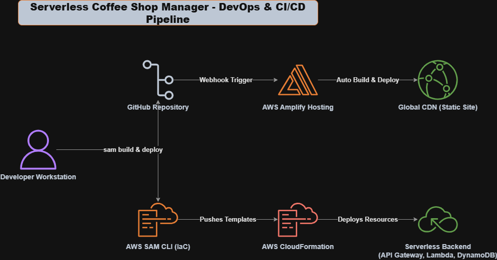

# Serverless Coffee Shop Manager

A fully serverless, full-stack inventory management system I designed and built to demonstrate the **Performance Efficiency** and **Operational Excellence** pillars of the AWS Well-Architected Framework. 

By leveraging AWS Serverless Application Model (SAM), Amazon API Gateway, AWS Lambda, DynamoDB, and AWS Amplify, this application provides a lightning-fast, highly scalable backend and a premium glassmorphic frontend—costing exactly **$0.00 while sitting idle** and scaling instantly to meet demand.

---

## Architecture and Detailed Component Breakdowns

To present my cloud infrastructure professionally, I have divided the system architecture into two distinct, self-contained sections. Each diagram has its own detailed explanation directly below it:

---

### Diagram 1: Runtime Traffic Flow (architecture.png)
Maps out the active end-to-end request path of an inventory transaction from the user's browser down to the database.


#### Runtime Architecture Component Breakdown:
*   **Hosting Layer (AWS Amplify / CloudFront CDN):** Hosts the static React single-page application (SPA). When a user requests the application, Amplify serves the Vite-built static files globally with microsecond latency via Amazon CloudFront's Content Delivery Network.
*   **API Gateway Layer (Amazon API Gateway):** Acts as the secure RESTful entry point for all frontend requests. It translates HTTP calls into Lambda invocation triggers and natively handles global **CORS Preflight (OPTIONS)** requests to permit safe write operations.
*   **Compute Layer (AWS Lambda):** Consists of four single-purpose, highly isolated CRUD functions (`GetInventory`, `AddInventory`, `UpdateInventory`, `DeleteInventory`) written in Node.js. They scale horizontally instantly and scale back down to zero to eliminate idle costs.
*   **Shared Lambda Layer (Node.js utils):** A custom reusable library I built to standardise backend responses. It centralises response compilation, ensuring every function replies with consistent HTTP status codes and required CORS headers without code duplication.
*   **Database Layer (Amazon DynamoDB):** A fully managed NoSQL database operating on `PAY_PER_REQUEST` billing. It stores the coffee shop's inventory items with sub-millisecond read/write latencies.

---

### Diagram 2: DevOps & CI/CD Pipeline (pipeline.png)
Maps out the automated code deployment loops, version control hooks, and Infrastructure as Code (IaC) management boundaries.



#### DevOps and CI/CD Pipeline Component Breakdown:
*   **Local Developer Workstation:** The starting point where code is written, locally tested, and packaged.
*   **GitHub Repository (Version Control):** The centralized source code repository. Committing code to GitHub automatically sends a webhook notification to AWS Amplify to start a frontend build.
*   **AWS Amplify Build System (Frontend Pipeline):** Listens to GitHub commits, auto-detects changes in the `frontend` subfolder, builds the static React bundle using Vite, and deploys it to the global CloudFront CDN.
*   **AWS SAM CLI & CloudFormation (Backend Pipeline):** Running `sam deploy --guided` packages local templates and uploads them to **AWS CloudFormation**. CloudFormation acts as the centralized transaction engine, cleanly provisioning or updating all Lambdas, API configurations, and the DynamoDB Table as a single unified stack.
*   **IAM Security Boundaries (Permissions):** During deployment, SAM and CloudFormation generate highly targeted, least-privilege IAM Roles. Each Lambda function is assigned a role strictly limiting it to the minimal database permissions needed for its execution (e.g. read-only vs write-only).

---

## CORS Security and Active Observability (Well-Architected Compliance)

To achieve strict compliance with **Security** and **Operational Excellence** standards, I engineered comprehensive cross-origin controls and production-grade monitoring systems.

### 1. Two-Layered CORS Architecture (Security)
To ensure secure browser-to-backend communications, I implemented a robust, two-layered CORS setup:
*   **Layer 1 (API Gateway Preflight):** API Gateway is globally configured in `template.yaml` to intercept and respond to browser preflight (`OPTIONS`) requests automatically. It responds to CORS checks with proper permitted methods (`GET, POST, PUT, DELETE, OPTIONS`) and standard AWS header configurations.
*   **Layer 2 (Lambda Response Integration):** To prevent duplicate headers in code, my shared Node.js Lambda Layer's `createResponse` utility automatically stamps standard access control headers (`Access-Control-Allow-Origin: *`) on every custom application payload.

### 2. Full Observability Stack (Operational Excellence & Performance Efficiency)
Rather than flying blind, this system actively monitors runtime operations and performance metrics automatically:
*   **AWS X-Ray (Distributed Tracing):** Enabled via `Tracing: Active` in the SAM template. It traces transactions end-to-end (Client ➔ API Gateway ➔ Lambda ➔ DynamoDB), providing a complete visual latency service map and isolating cold starts or function bottlenecks.
*   **Amazon CloudWatch (Metrics & Logs):** API Gateway and AWS Lambda automatically stream standard telemetry data (invocations, duration milliseconds, HTTP error counts) to CloudWatch dashboards. All execution stack trace errors are automatically outputted to `/aws/lambda/coffeeshop-inventory-*` log groups for instant debugging.

---

## System Prerequisites

To ensure a smooth, error-free setup, make sure you have these prerequisites installed. I have listed the direct terminal installation commands (using Windows Package Manager `winget`) and verification commands for each:

### 1. Node.js (v18 or higher)
Required for running the React frontend and packages locally.
*   **Install Command:**
    ```cmd
    winget install OpenJS.NodeJS
    ```
*   **Verification Commands:**
    ```cmd
    node -v
    npm -v
    ```

### 2. AWS Command Line Interface (AWS CLI)
Used to authenticate your machine with your AWS account.
*   **Install Command:**
    ```cmd
    winget install Amazon.AWSCLI
    ```
*   **Authentication & Configuration:**
    ```cmd
    aws configure
    ```
*   **Verification Command (Checks active AWS session):**
    ```cmd
    aws sts get-caller-identity
    ```

### 3. AWS Serverless Application Model (SAM CLI)
The command-line tool used to package, build, and deploy serverless infrastructure stacks.
*   **Install Command:**
    *   *Option A (Terminal):*
        ```cmd
        winget install -e --id Amazon.SAM-CLI
        ```
    *   *Option B (Manual MSI):* Download and run the [AWS SAM CLI 64-bit MSI Installer](https://github.com/aws/aws-sam-cli/releases/latest/download/AWS_SAM_CLI_64_PY3.msi).
*   **Verification Command:**
    ```cmd
    sam --version
    ```
> [!IMPORTANT]
> **Windows Environment Variable Refresh:** Refreshing command environments requires completely closing and restarting your terminal or VS Code to register the new command paths on your system.

---

## Step-by-Step Deployment Guide

Follow these highly explicit, step-by-step instructions to get the entire stack live in your AWS account.

### Phase 1: Deploying the Serverless Backend (IaC)

My backend infrastructure is completely managed as code using AWS SAM. 

1.  Open your terminal or Command Prompt and navigate to the backend directory:
    ```bash
    cd backend
    ```
2.  Build your serverless applications (this packages your Lambda Layer and compiles your functions):
    ```bash
    sam build
    ```
3.  Deploy the resources to your AWS account. I use the `--guided` flag for the initial setup to store configuration settings:
    ```bash
    sam deploy --guided
    ```
4.  Answer the guided prompts exactly as follows:
    *   **Stack Name [sam-app]:** Type `coffeeshop-inventory` and press **Enter**.
    *   **AWS Region [us-east-1]:** Press **Enter** to accept your default region, or type your preferred region (e.g. `us-west-2`).
    *   **Confirm changes before deploy [y/N]:** Press **Enter** (default is N).
    *   **Allow SAM CLI IAM role creation [Y/n]:** Type **`y`** and press **Enter** (necessary to auto-create Lambda execution roles).
    *   **Disable rollback [y/N]:** Press **Enter** (default is N).
    *   **GetInventoryFunction has no authentication. Is this okay? [y/N]:** Type **`y`** and press **Enter**. *(SAM will ask this 4 times—once for each CRUD function. Always answer `y` to allow public API access).*
    *   **Save arguments to configuration file [Y/n]:** Press **Enter** (default is Y, which creates your local `samconfig.toml`).
    *   **SAM configuration file [samconfig.toml]:** Press **Enter**.
    *   **SAM configuration environment [default]:** Press **Enter**.
5.  Wait for CloudFormation to create the resources. When complete, the terminal will show a green **`Outputs`** block.
6.  Locate the line starting with **`InventoryApiUrl`** (e.g., `https://xyz123.execute-api.us-east-1.amazonaws.com/Prod/inventory`). **Copy this URL carefully!**

---

### Phase 2: Running and Hooking Up the React Frontend

Now, connect the frontend user interface to your live API.

1.  Open a new terminal window (Windows users: use standard **Command Prompt (cmd.exe)** to bypass PowerShell script execution restrictions) and navigate to the frontend:
    ```cmd
    cd frontend
    ```
2.  Install the required node packages:
    ```cmd
    npm install
    ```
3.  Connect the app to your live API Gateway:
    *   Open `frontend/src/App.jsx` in your code editor.
    *   Find the `API_URL` declaration near the top (Line 6).
    *   Paste your copied URL as the value, wrapping it in quotes:
        ```javascript
        const API_URL = import.meta.env.VITE_API_URL || "https://your-api-gateway-id.execute-api.us-east-1.amazonaws.com/Prod/inventory";
        ```
4.  Launch the hot-reloading local development server:
    ```cmd
    npm run dev
    ```
5.  Open your browser and navigate to **`http://localhost:5173/`**. You can now add, edit, and delete items, seeing them update your live AWS DynamoDB database in real-time!

---

### Phase 3: Setting Up Production Hosting (AWS Amplify)

Host your frontend on a fast global CDN with automated Git-connected CI/CD.

1.  Commit and push all your working code changes to your personal GitHub repository:
    ```bash
    git add .
    git commit -m "feat: complete full CRUD integration with live AWS backend"
    git push origin main
    ```
2.  Open your web browser and go to the **AWS Amplify Console**.
3.  Click **Create new app** (or **Host web app**).
4.  Choose **GitHub** as the source, authorize AWS Amplify, and select your repository: `aws-wellarchitected-framework-performance-efficiency`.
5.  Choose your branch (`main`) and click **Next**.
6.  On the **Configure build settings** page, configure the monorepo settings exactly:
    *   Check the box that says **"Connecting a monorepo? Check this box."**
    *   In the **Monorepo folder path** text box, enter: **`frontend`**
    *   *Note: Using just `frontend` is critical because it sits directly at the root of your remote repository.*
7.  Click **Next**, review the settings, and click **Save and Deploy**.
8.  Amplify will now automatically build and host your site. Once complete, you will receive a secure, live, public URL (`.amplifyapp.com`) to access your application globally!

---

### Phase 4: Cleaning Up Resources (Teardown)

Because this application leverages serverless pay-per-request pricing, it costs nothing when not being accessed. However, if you want to completely remove all resources from your AWS account to keep it pristine, follow these teardown steps:

#### Step 1: Delete the Backend Stack
Navigate to your backend folder and run the delete command:
```bash
cd backend
sam delete
```
Type **`y`** to confirm. CloudFormation will automatically and safely destroy your API Gateway, Lambdas, IAM execution roles, and the DynamoDB Table within seconds.

#### Step 2: Delete the AWS Amplify App
1.  Open the **AWS Amplify Console** in your browser.
2.  Click on your **app name** to open its dashboard.
3.  In the left-hand sidebar menu, scroll to the bottom and click **App settings**.
4.  In the top-right corner of the page, click the **Actions** dropdown menu and select **Delete app**.
5.  Type the confirmation prompt as requested and click **Delete**. All global hosting assets will be wiped out immediately.

---

## Troubleshooting Quick Reference

*   **PowerShell Execution policy errors (UnauthorizedAccess):** Run commands inside **Command Prompt (cmd.exe)** or run `Set-ExecutionPolicy -Scope Process -ExecutionPolicy Bypass` in PowerShell to temporarily bypass script blocks.
*   **Amplify deployment fails with a 404 REST Error:** Ensure your monorepo folder path is configured exactly as **`frontend`** (not `performance efficiency/frontend`), as the parent folder is the root of your repository on GitHub.
*   **Delete stack fails due to non-empty S3 bucket (aws-sam-cli-managed-default):** S3 blocks bucket deletions if they contain older deployment zips. Open the **S3 Console**, search for your SAM CLI source bucket, click **Empty**, type `permanently delete` to confirm, and then run `sam delete --stack-name aws-sam-cli-managed-default` to clean up your bootstrap stack.
