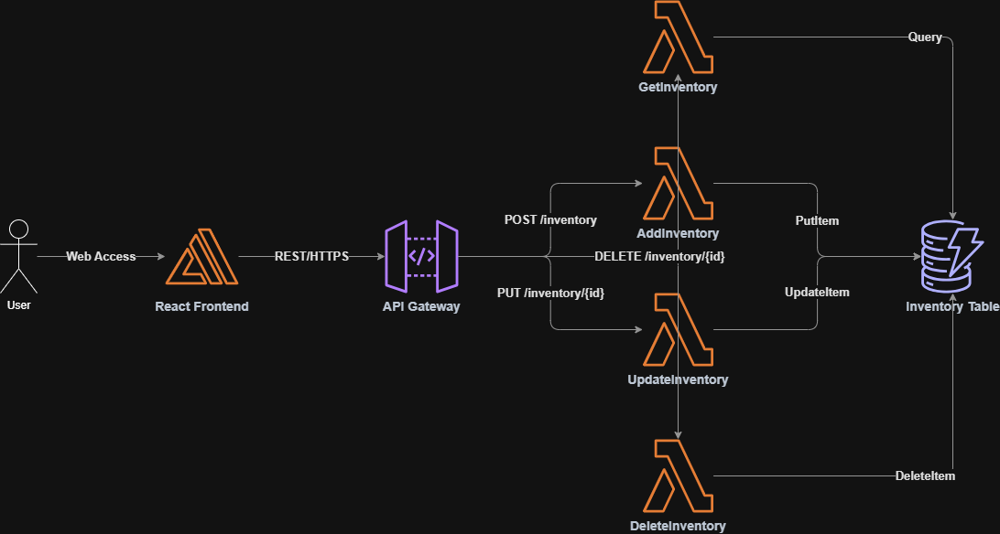

# Serverless Coffee Shop Manager ☕

A fully serverless, full-stack inventory management system designed to demonstrate the **Performance Efficiency** pillar of the AWS Well-Architected Framework. 

By leveraging AWS Serverless Application Model (SAM) and on-demand pricing models, this application provides an incredibly fast, highly scalable backend that costs exactly $0.00 while sitting idle.

## 🏗️ Architecture



* **Frontend:** A modern, glassmorphism-inspired React application built with Vite for lightning-fast hot module replacement.
* **API Layer:** Amazon API Gateway providing secure RESTful endpoints.
* **Compute:** AWS Lambda functions written in Node.js (JavaScript) for rapid cold starts and execution.
* **Storage:** Amazon DynamoDB using `PAY_PER_REQUEST` (On-Demand) billing to ensure you only pay for the exact read/write capacity you consume.

---

## 🛠️ Prerequisites

Before you begin, ensure you have the following installed on your local machine:
1. **Node.js** (v18 or higher) - For running the React frontend.
2. **AWS CLI** - Authenticated with your AWS account (`aws configure`).
3. **AWS SAM CLI** - Used for building and deploying the backend infrastructure. 
   - *Windows Users:* If you don't have it, download the [AWS SAM CLI 64-bit MSI](https://github.com/aws/aws-sam-cli/releases/latest/download/AWS_SAM_CLI_64_PY3.msi) and install it as an Administrator.

---

## 🚀 Step 1: Deploying the Backend

The backend is entirely managed by AWS SAM. We will build the Lambda functions and deploy the infrastructure to your AWS account.

1. Open your terminal and navigate to the backend directory:
   ```bash
   cd backend
   ```
2. Build the serverless application:
   ```bash
   sam build
   ```
3. Deploy the application to your AWS account. We use the `--guided` flag to set it up for the first time:
   ```bash
   sam deploy --guided
   ```
   * **Stack Name:** `coffeeshop-inventory` (or your preferred name)
   * **AWS Region:** Select your closest region (e.g., `us-east-1`)
   * Accept the defaults for the remaining prompts by pressing **Enter**. Type `Y` when asked if SAM can create IAM roles.

4. Once the deployment finishes, the terminal will output an **`InventoryApiUrl`**. Copy this URL! You will need it for the frontend.

---

## 🎨 Step 2: Running the Frontend

The frontend is a beautiful, responsive React application. 

1. Open a *new* terminal window (or Command Prompt if you are on Windows to bypass PowerShell execution policies) and navigate to the frontend directory:
   ```bash
   cd frontend
   ```
2. Install the necessary Node modules:
   ```bash
   npm install
   ```
3. Connect the frontend to your newly deployed backend:
   - Open `frontend/src/App.jsx` in your code editor.
   - Look for the `API_URL` variable near the top of the file.
   - Replace the `null` value with the **`InventoryApiUrl`** you copied from the backend deployment step. Make sure the URL is wrapped in quotes.
   
4. Start the local development server:
   ```bash
   npm run dev
   ```
5. Open your browser and navigate to `http://localhost:5173/` to view and manage your live coffee shop inventory!

---

## ⚠️ Troubleshooting

* **PowerShell Execution Errors (`npm` or `npx` fails):** Windows PowerShell restricts running scripts by default. To fix this, run your `npm` commands inside the standard **Command Prompt** (`cmd.exe`) instead of PowerShell, or temporarily bypass the policy by running `Set-ExecutionPolicy -Scope Process -ExecutionPolicy Bypass` in your PowerShell window.
* **`sam` command not recognized:** This means the AWS SAM CLI isn't installed properly or hasn't been added to your system's PATH. Ensure you have downloaded the MSI installer and completely restarted your VS Code or Terminal afterward.
* **Ghost IDE Errors (Python):** If your editor complains about missing Python `utils` modules in `app.py`, it's because those files were deleted and rewritten in JavaScript (`app.js`). Simply close the `.py` tabs in your editor to clear the errors.
